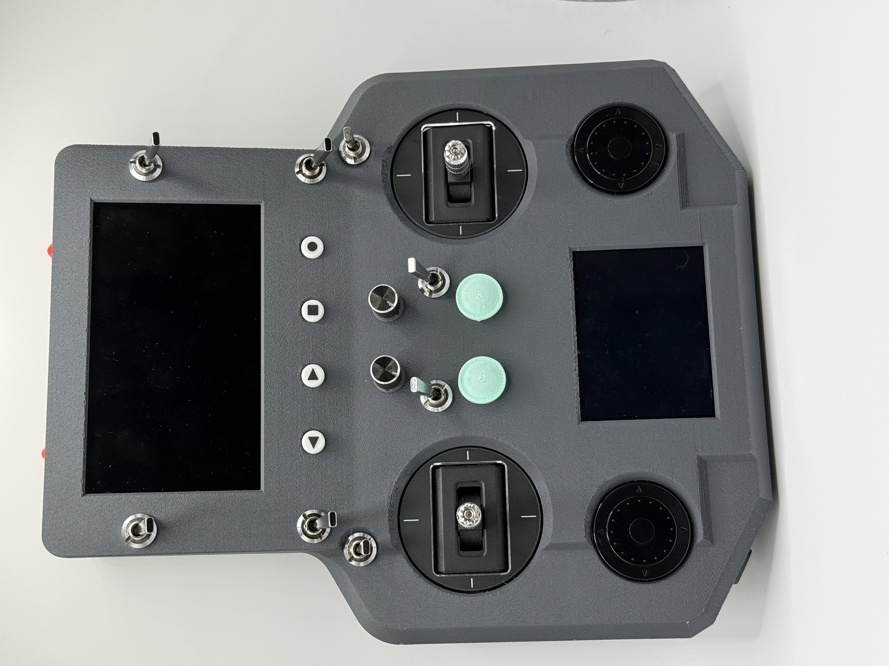
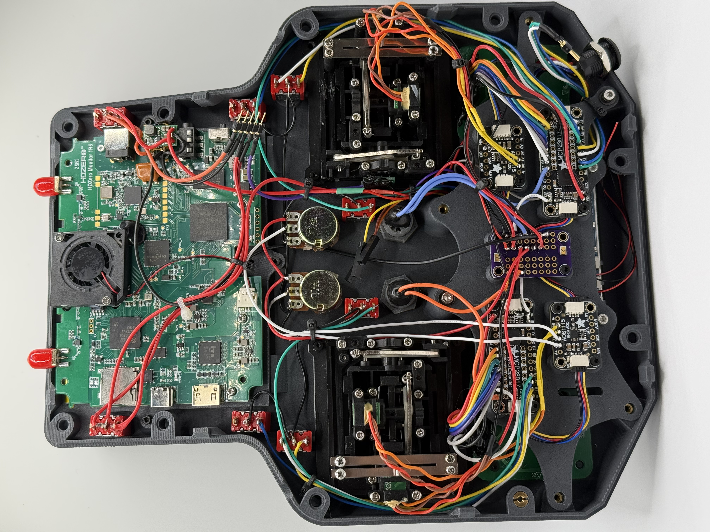

# OpenRC-Transmitter

[](LICENSE)
[](https://buymeacoffee.com/vitormhenrique)

OpenRC-Transmitter is an ESP32-S3, touch-screen, ExpressLRS/CRSF handheld
controller for robots. It combines a dense physical control surface with an
LVGL user interface, calibrated analog inputs, configurable ELRS devices, and
a 16-channel CRSF packet contract intended for high-capability robot control.

It is currently configured for the HexNav hexapod, but the controller keeps a
generic robot profile and separates physical inputs from the receiver-side
robot interpretation. The receiving controller must always own actuator
limits, arming, emergency stop, and failsafe behavior.



## Capabilities

- ESP32-S3 firmware built with Arduino, FreeRTOS tasks, LVGL, and PlatformIO.
- ST7789 240 x 320 display with CST328 touch support and configurable
  backlight.
- Two gimbals, two potentiometers, two rotary encoders, six two-position
  switches, two three-position switches, four buttons, and two five-way
  navigation controls.
- Two MCP23017 I2C GPIO expanders for digital controls and three available
  ADS1115 I2C ADC addresses for analog inputs. The present configuration uses
  the `0x48` and `0x49` ADCs; `0x4A` is reserved for expansion.
- Calibration workflows for touch, gimbals, and potentiometers. Gimbal and
  potentiometer calibration data, plus robot profile selection, are persisted
  in ESP32 NVS.
- Generic and Hexapod robot profiles, with a dedicated hexapod telemetry view
  and control map.
- Half-duplex CRSF at 420000 baud, normal 50 Hz RC frames, low-rate bootstrap
  frames while the link comes up, periodic device discovery, and automatic
  silent retry when a TX module does not respond.
- Received telemetry for CRSF link statistics, battery state, attitude, and
  versioned hexapod status.
- A touch UI that discovers the actual ExpressLRS TX or receiver parameter
  tree over CRSF rather than relying on hard-coded parameter IDs.
- A USB serial `radio` CLI for discovering and reading or writing the ELRS
  transmitter's switch-mode setting.
- A desktop SDL2 simulator that runs the production LVGL UI without the radio
  hardware.



## Hardware Baseline

The current firmware target is `esp32-s3-devkitc-1`. Its PlatformIO environment
declares a 16 MB QIO OPI flash configuration and enables PSRAM; verify that the
physical board matches those settings before flashing. This is not a general
board definition: the input assignments, display pins, and CRSF link are
tailored to this controller assembly.

| Subsystem | Current implementation |
| --- | --- |
| Main controller | ESP32-S3 DevKitC-1, Arduino-ESP32 3.0.2 / ESP-IDF 5.1.4 platform package |
| Display | ST7789, 240 x 320, SPI; CST328 touch integration |
| Digital inputs | MCP23017 expanders at `0x20` and `0x21` |
| Analog inputs | ADS1115 devices at `0x48`, `0x49`, and reserved `0x4A` |
| CRSF serial link | `Serial1`, 420000 baud, GPIO15 TX, GPIO44 RX, GPIO18 active-high buffer enable |
| Radio configuration | Dynamic CRSF parameter client for the selected ELRS TX module or receiver |

The CRSF TX line deliberately uses GPIO15 rather than GPIO43: GPIO43 can emit
ROM boot messages that disrupt an attached ELRS module. The tri-state output
buffer defaults to high impedance during boot so the controller does not send
spurious bytes while the UI initializes.

## ExpressLRS Configuration

OpenRC-Transmitter is a CRSF handset for an ExpressLRS TX module. It does not
set the receiver's actuator policy; configure the paired receiver and robot
controller to fail safe independently.

1. Flash compatible ExpressLRS firmware to the TX module and receiver. Use
   the same binding phrase on both devices, or use the normal ExpressLRS bind
   procedure.
2. Set the TX module's **Switch Mode** to a full 16-channel option. Typical
   ELRS wording is `Full`, `100Hz Full`, `333Hz Full`, or `16ch Rate/2 Full
   Res`; use the exact option offered by the installed module. Do not select a
   reduced-channel, hybrid, or 8-channel mode because OpenRC control data uses
   CH9 through CH11.
3. Keep the CRSF handset link at 420000 baud. The firmware sends 50 Hz normal
   RC frames after the link is ready and 10 Hz centered bootstrap frames while
   the module is starting.
4. Verify the receiver's channel monitor before connecting a robot. Confirm
   CH1 through CH11 change as described below and CH12 through CH16 remain
   centered.
5. Confirm robot failsafe, E-stop, and arming behavior with actuators made
   mechanically safe. A healthy radio link is not proof that robot output is
   safe.

### Configure From the Transmitter

Open **Settings > Radio** to select the TX module or receiver and browse its
live CRSF parameter tree. The UI discovers options from the connected device,
uses a confirmation dialog for writes and commands, and reports operation
status rather than assuming a particular ELRS firmware layout.

The USB CDC console exposes the same module discovery path:

```text
radio help
radio refresh
radio get switch
radio set switch <exact discovered option>
```

Run `radio refresh` before changing a value. The write is reported as verified
only after the module confirms it.

The bundled [TX16S profile package](TX16S%20MK3/README_IMPORT.txt) is a
separate EdgeTX reference model for a conventional transmitter. It is useful
for the HexNav receiver setup, but its mixer layout is not the OpenRC CRSF
packet format documented below.

## CRSF Channel Contract

OpenRC sends a standard CRSF `RC_CHANNELS_PACKED` frame with 16 packed 11-bit
channels. Analog controls are mapped into the valid CRSF range `191..1792`,
and discrete fields are scaled across that same range so ELRS does not clamp
low-valued states together.

| Channel | Payload | Notes |
| --- | --- | --- |
| CH1 | Left gimbal X | Proportional, `-1000..1000` input range |
| CH2 | Left gimbal Y | Proportional, `-1000..1000` input range |
| CH3 | Right gimbal X | Proportional, `-1000..1000` input range |
| CH4 | Right gimbal Y | Proportional, `-1000..1000` input range |
| CH5 | Pot 1 and `SW_A` arm request | The arm state selects a guarded lower or upper band; Pot 1 remains available within that band |
| CH6 | Pot 2 | Proportional, `0..1000` input range |
| CH7 | Encoder 1 | Wrapped 11-bit encoder position |
| CH8 | Encoder 2 | Wrapped 11-bit encoder position |
| CH9 | `SW_B`, `SW_C`, `SW_D`, `SW_G`, `SW_H` | Five-bit auxiliary switch mask |
| CH10 | `BTN_1..4`, `SW_E`, `SW_F` | One pressed button plus the two three-position switch states |
| CH11 | `NAV1`, `NAV2` | One active direction or center state for each five-way navigation control |
| CH12..CH16 | Reserved | Held at the CRSF center value |

Use the shared [`ChannelPack`](lib/ChannelPack/ChannelPack.h) implementation
on the receiver side whenever possible. CH9 through CH11 are compact encoded
control states, not independent PWM-style auxiliary channels; a normal RC
mixer cannot recover their individual controls without the corresponding
decoder.

## Hexapod Default Controls

The HexNav mapping is the current complete robot profile. It is documented in
detail in [docs/hexapod_controls.md](docs/hexapod_controls.md); the most useful
operator summary is below.

| Input | Hexapod action |
| --- | --- |
| Left gimbal | Always walks: Y is forward/back and X is strafe |
| Right gimbal, `SW_F` UP | X turns the robot; Y is unassigned |
| Right gimbal, `SW_F` CENTER | Shift body Y/X while walking |
| Right gimbal, `SW_F` DOWN | Apply body roll/pitch while walking |
| Pot 1 / Pot 2 | Gait cadence and torque recovery / body height |
| `SW_A` / `SW_B` | Arm request / immediate E-stop and disarm request |
| `SW_C` / `SW_D` | Foot-contact detection / terrain-leveling request |
| `SW_E` | Walk pattern: wave, ripple, tripod |
| `SW_F` | Right-gimbal job: turn, translate body, rotate body |
| `SW_G` | Enter or exit the gait-tuning editor |
| `SW_H` | Permit USB host or Jetson motion authority |
| `BTN_1..4`, `NAV1`, `NAV2` | Stand/sit/pose actions, trims, gait tuning, and bounded choreography |

`SW_B` and receiver failsafe must override every other command source. The
hexapod firmware validates every requested feature and action; switch state
alone cannot bypass its safety state machine.

## Build and Flash

### Requirements

- [PlatformIO Core](https://docs.platformio.org/en/latest/core/) 6.x
- A USB connection to the ESP32-S3 controller
- The board's USB serial identifier configured in `platformio.ini`, or an
  updated `upload_flags` / `monitor_port` for the connected board

The project pins the `pioarduino` platform release that supplies the required
Arduino-ESP32 3.0.2 toolchain. PlatformIO installs the declared dependencies,
including LVGL and the Adafruit ADS1X15 and MCP23017 libraries.

```bash
# Build the ESP32-S3 firmware.
pio run -e esp32_tx_remote

# Upload the same environment.
pio run -e esp32_tx_remote -t upload

# Inspect USB CDC logs at 115200 baud.
pio device monitor -e esp32_tx_remote
```

The firmware starts the CRSF task before normal input polling and holds the
radio output buffer disabled at boot. After flashing, verify the on-screen
input state and receiver channel monitor before using an armed robot.

## Desktop UI Simulator

The SDL2 simulator compiles the production LVGL UI with desktop hardware
stubs. It is useful for screen development, touch workflows, and visual
regression checks; it does not emulate gimbals, switches, or the radio link.

```bash
cd simulator
just build
just run
```

See [simulator/README.md](simulator/README.md) for macOS/Linux prerequisites
and all simulator commands.

## Project Layout

```text
src/                    ESP32-S3 firmware, UI, input drivers, CRSF, ELRS client
lib/ChannelPack/        Shared 16-channel CRSF pack/unpack contract
docs/                   Hexapod controls and ELRS Lua reference scripts
TX16S MK3/              Optional EdgeTX profile and import instructions
simulator/              SDL2 desktop build of the production LVGL UI
img/                    OpenRC-Transmitter assembly photographs
platformio.ini          ESP32-S3 build, upload, library, and feature settings
```

## License

OpenRC-Transmitter is licensed under the [MIT License](LICENSE).